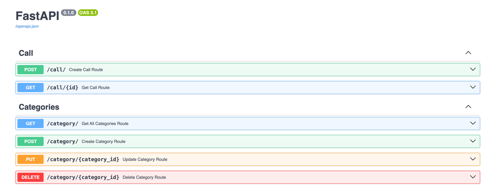
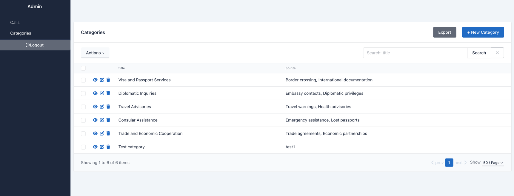

# Audio Analyze Service

## Technology Stack
* `Python/FastAPI` - Chosen for its speed, async support, and built-in Swagger documentation.
* `PostgreSQL/SQLAlchemy` - Reliable database with ORM for scalability and flexibility.
* `Alembic`
* `pytest`
* `Docker/docker-compose`

# Instruction
To start project use: `docker-compose up -d --build`

To start tests on project use: `docker-compose exec app pytest tests`

To down project use: `docker-compose down`

# Info about project

After you started the project by this url: `http://127.0.0.1:8080/api/docs` you can achieve Documentation(Swagger):

And By this url you can achieve admin panel for comfort managing data: `http://127.0.0.1:8080/admin`

In this project to Anlyze Audio i am using there library's
- `Speech Recognation`, https://pypi.org/project/SpeechRecognition/ - To transcript audio into text
- `vaderSentiment`, https://pypi.org/project/vaderSentiment/ - To determine emotion of text
- `nltk`, https://www.nltk.org/ - To extract from text Person and location

All this libraries can work offline 

# Next Steps to improve this solution

The main one on my opinion is to make research and explore more powerful NLP models for better accuracy.